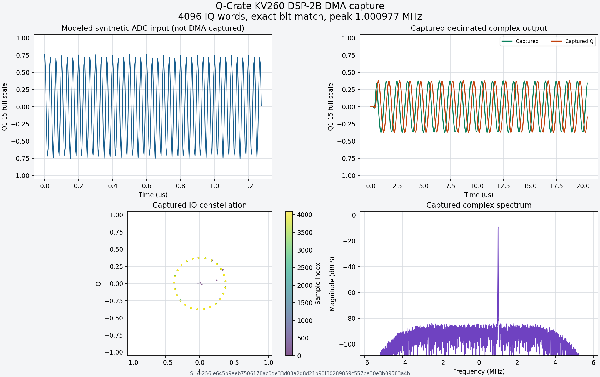

# Q-Crate

Q-Crate is a reproducible FPGA instrumentation platform built around the AMD
Kria KV260. It combines deterministic pulse control, framed AXI4-Stream data,
scatter-gather DMA, embedded Linux, and a FreeRTOS/OpenAMP control service.

The repository is organized as source rather than a checked-in Vivado or Vitis
workspace. Vivado projects, generated software platforms, PetaLinux build
trees, bitstreams, XSA files, and SD-card images are rebuilt from tracked RTL,
Tcl, configuration, recipes, and scripts.

## Current capabilities

| Area | Implemented capability |
|---|---|
| Control plane | APB fabric with system, stream, interrupt, and sequencer register pages |
| Clocking | 100 MHz control domain and 200 MHz stream/timing domain with explicit CDC |
| Streaming | Backpressure-correct framed counter and complex DSP sources |
| DMA | Linux DMAEngine client with coherent buffers and finite scatter-gather frame chains |
| Linux platform | Fixed PetaLinux platform generated from the accepted KV260 XSA |
| Heterogeneous control | Linux `remoteproc` plus VirtIO RPMsg to R5-0 FreeRTOS/OpenAMP |
| Timing | Shared 64-bit 200 MHz timebase and deterministic two-channel event sequencer |
| Sequence tooling | Standard-library Python compiler with a versioned, CRC-protected binary format |
| DSP | Bit-accurate 200 MHz synthetic ADC, DDC, FIR decimator, AXI framing, and Python model |
| Networking | Accepted Gigabit baseline, Data Plane v1 contract, and replayable finite-shot receiver |

The pulse sequencer has passed RTL, PetaLinux, direct A53 bring-up, and final
R5-owned upload and lifecycle testing on the KV260.

## Validated DSP capture



The KV260 DSP-2B path runs a deterministic 200 MS/s synthetic ADC through a
29 MHz complex downconverter and a 217-tap decimate-by-16 FIR, then transfers
the 12.5 MS/s Q1.15 IQ stream to DDR through scatter-gather DMA. The displayed
4096-word hardware capture matched the bit-accurate Python model exactly and
shows the expected positive 1 MHz translated tone. The modeled-input versus
captured-output interpretation, binary format, FFT resolution, and complete
reproduction procedure are documented in the
[DSP model and capture viewer](host/dsp_model/README.md).

## Architecture

```text
Development host
  Python sequence compiler
  Vivado/Vitis/PetaLinux batch flows
              |
              v
KV260 A53 Linux
  userspace tools and DMA client driver
              |
              +---- AXI DMA ----> DDR capture buffers
              |
              +---- RPMsg ----> R5-0 FreeRTOS control service
                                      |
                                      v
                         100 MHz APB control plane
                                      |
                                      v
                         200 MHz stream/timing plane
                           AXI stream + sequencer
```

Linux owns DMA descriptors, capture buffers, and non-real-time policy. R5-0
owns bounded real-time sequencer validation and lifecycle commands. The PL
executes pulse timing and stream generation independently of Linux scheduling.

## Repository layout

```text
common/
  dma/                   shared Linux DMA userspace ABI
  data_plane/            shared C/Python UDP wire contract and codec tests
  protocol/              shared A53/R5 RPMsg wire ABI
  sequence/              shared deterministic sequence format
config/                   reproducible FPGA build configuration
host/sequence_compiler/   JSON-to-QSEQ compiler and host tests
host/data_plane/          host codec, finite-shot UDP receiver, journal, and replay
host/dsp_model/           DSP numerical contract, generated tables, and tests
rtl/dsp/                  portable NCO/DDC/FIR RTL and shared numerical tables
rtl/tb/                   portable RTL self-checking testbenches
kv260/hw/
  bd/                     exported block-design Tcl
  rtl/                    handwritten SystemVerilog
  tb/                     self-checking SystemVerilog testbenches
kv260/linux/
  data_plane/             compiled finite DMA-to-UDP sender and acceptance
  dma/                    DMA architecture and acceptance notes
  network/                Ethernet baseline tooling
  openamp/                Linux/R5 OpenAMP architecture and client
  petalinux/              tracked project specification and deployment flow
kv260/r5_freertos/        R5-0 FreeRTOS RPMsg service
kv260/vitis/              reproducible Vitis firmware flow
scripts/                  Vivado and packaging entry points
```

Start with [the KV260 platform overview](kv260/README.md). Detailed procedures
are kept beside the subsystem they describe:

- [hardware, RTL simulation, clocks, reset, and ILA](kv260/hw/README.md)
- [fixed PetaLinux build and SD-card deployment](kv260/linux/petalinux/README.md)
- [DMAEngine capture and scatter-gather DMA](kv260/linux/dma/README.md)
- [R5 FreeRTOS and OpenAMP](kv260/linux/openamp/README.md)
- [sequence binary format](common/sequence/README.md)
- [sequence compiler](host/sequence_compiler/README.md)
- [DSP-0 numerical contract and bit-accurate model](host/dsp_model/README.md)
- [portable NCO, DDC mixer, and FIR decimator](rtl/dsp/README.md)
- [network baseline](kv260/linux/network/README.md)
- [Data Plane v1 wire protocol](common/data_plane/README.md)
- [host receiver and capture bundle](host/data_plane/README.md)
- [KV260 finite-shot UDP sender](kv260/linux/data_plane/README.md)
- [historical Kria Ubuntu and `xmutil` bring-up](kv260/linux/README.md)

## Toolchain

The accepted tool versions are:

- Vivado, Vitis, and PetaLinux 2024.2
- KV260/K26 target, part `xck26-sfvc784-2LV-c`
- Python 3.10 or newer
- Verilator for lightweight RTL tests
- a Linux development host

AMD tools and the KV260 BSP are not redistributed by this repository. Install
them separately and accept their licenses before running the complete flow.

The default [build configuration](config/build.json) expects the AMD tools
under `/tools/Xilinx`. Edit `vivado_settings` and `vitis_settings` when your
installation uses a different location. Build and artifact paths are resolved
relative to the repository root.

## Hardware build

Preview the command without starting Vivado:

```bash
python3 scripts/build.py --stage project --dry-run
```

Create the Vivado project and block design only:

```bash
python3 scripts/build.py --stage project
```

Run a clean end-to-end hardware build through bitstream and XSA export:

```bash
python3 scripts/build.py --stage all
```

Individual `synth`, `impl`, `bitstream`, and `export` stages can reuse valid
completed runs. `all` intentionally recreates the complete hardware build.

## Host tests

The host numerical, sequence compiler, and target protocol tests do not require
AMD tools:

```bash
python3 -m unittest discover -s host/sequence_compiler/tests -v
python3 -m unittest discover -s host/dsp_model/tests -v
python3 -m unittest kv260/linux/tests/test_qcrate_sequence_tool.py -v
```

The SystemVerilog testbenches cover APB, CDC, stream generation, sequencer
execution, and the integrated sequencer subsystem. Exact Verilator and XSim
commands are documented in [the hardware README](kv260/hw/README.md).

## Software platform

The normal dependency order is:

```text
Vivado bitstream/XSA
        |
        +--> Vitis R5-0 FreeRTOS firmware
        |
        +--> PetaLinux hardware configuration
                    |
                    v
          root filesystem, boot firmware,
          bitstream, kernel, device tree, and SD image
```

Build and stage the R5 firmware after exporting the XSA:

```bash
python3 kv260/vitis/vitis_flow.py all
```

The PetaLinux flow provides separate `configure`, `build`, `package`, `deploy`,
and `finalize` actions. SD-card deployment is destructive and requires an
explicit whole-device path. Follow the audited procedure in
[the PetaLinux README](kv260/linux/petalinux/README.md), including its device
identity and first-boot checks.

## Generated files

Generated workspaces and artifacts are intentionally ignored. In particular,
do not commit `.Xil`, Vivado project directories, PetaLinux temporary/build
trees, Vitis workspaces, bitstreams, XSA files, ELF files, or SD-card images.
Use release artifacts or external storage for reproducible binary releases and
publish matching source revisions and checksums.

## Project status

Q-Crate is an active engineering and learning project. The KV260 fixed
platform, APB control plane, framed DMA acquisition, FreeRTOS/OpenAMP vertical
slice, deterministic sequencer, bit-accurate DSP model, synthesizable DDC/FIR
chain, and model-verified DMA capture are implemented and accepted on hardware.
The UDP wire contract, cross-language codecs, replayable host receiver, and
compiled finite-shot KV260 sender are implemented and accepted end to end.
The received capture passed packet-integrity, CRC, and bit-accurate DSP-model
checks. A physical ADC adapter, continuous network acquisition, and expansion
to additional instrumentation nodes remain future work.
