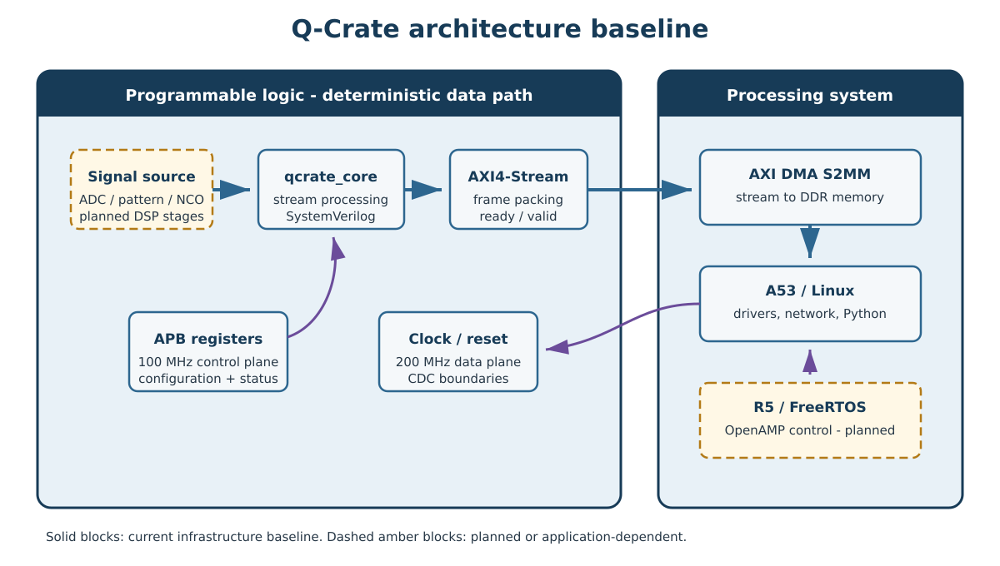

# Preface

Q-Crate is a learning-driven FPGA instrumentation project with the potential to
grow into a reusable high-speed acquisition, signal-processing, and control
platform. This guide records both the engineering foundations and the concrete
implementation decisions behind the project.

The document has three purposes:

1. to explain the digital-design and signal-processing concepts needed to
   understand the system;
2. to document the Q-Crate architecture and implementation as they evolve; and
3. to preserve design reasoning, verification methods, and lessons learned.

This is a **living engineering document**. Statements marked *implemented*
describe the current design baseline. Statements marked *planned* describe the
intended direction and may change after simulation or hardware experiments.

> **Version 0.1 scope.** This first edition establishes the system vocabulary,
> the current architecture baseline, and the theoretical path from sampled data
> to complex baseband processing. Later editions will expand the RTL, firmware,
> verification, and measured-performance chapters alongside development.

## Document conventions

| Convention | Meaning |
|---|---|
| **Implemented** | Present in the established Q-Crate design baseline |
| **Planned** | Intended architecture, not yet claimed as verified hardware |
| `signal_name` | RTL signal, register, filename, command, or identifier |
| $x[n]$ | Discrete-time signal indexed by sample number $n$ |
| $f_s$ | Sampling frequency in samples per second |

## Revision history

| Version | Date | Summary |
|---|---|---|
| 0.1 | 2026-08 | Initial architecture and DSP foundations |

\newpage

# Introducing Q-Crate

## Motivation

Modern instrumentation often needs the same combination of capabilities:

- deterministic signal generation and acquisition;
- low-latency digital signal processing;
- software-configurable control and monitoring;
- sustained movement of large sample streams;
- synchronisation between hardware, firmware, and host software; and
- enough observability to debug the complete chain.

Commercial platforms can solve these problems, but they often hide the details
that an engineer needs to learn or constrain the system to a fixed workflow.
Q-Crate approaches the problem from the opposite direction. It begins as an
open engineering platform whose internal data path is deliberately understood,
implemented, measured, and documented.

The name **Q-Crate** is currently a project name. The architecture is not tied
to a single application. Possible future uses include laboratory data
acquisition, waveform generation, quantum-control experiments, LiDAR or radar
prototyping, and general FPGA-based instrumentation.

## Project goals

The near-term engineering goals are:

1. establish a clean Zynq UltraScale+ hardware/software architecture;
2. generate and process deterministic streaming data in programmable logic;
3. control the datapath through memory-mapped registers;
4. transfer samples to processor memory through AXI DMA;
5. observe and analyse results from software, including Python tools;
6. develop reusable DSP blocks such as an NCO, mixer, filters, decimators, and
   interpolators; and
7. verify each block in simulation before integrating it on hardware.

The project is also a structured learning vehicle for SystemVerilog, AXI,
DMA, fixed-point DSP, embedded Linux, FreeRTOS, and heterogeneous processing.

## First reference application

The first integrated application is the **Networked Pulsed-IQ Analyzer**. An
R5-supervised PL sequence produces deterministic excitation and acquisition
events. The DSP path creates a coherent IQ response, DMA moves each triggered
shot into explicitly owned memory, and the versioned network data plane sends
it to a host for time-domain, magnitude, phase, and spectral analysis.

The first implementation uses a deterministic RTL source and channel model.
This is deliberate: it makes every sample and timestamp verifiable before an
analogue front end introduces clock, noise, and converter uncertainties. A
later ADC replaces the source while preserving the control, timing, DMA,
network, recording, and analysis architecture.

The application establishes an important data-integrity rule for future
acquisition buffers:

```text
FREE -> FILLING -> READY -> USER_OWNED -> FREE
```

Unread measurement data is never overwritten silently. A resource shortage is
reported as starvation or a skipped acquisition rather than hidden by stale or
torn data.

## Non-goals of Version 0.1

This edition does not claim a finished instrument, a frozen external interface,
or measured analogue performance. ADC/DAC selection, RF front-end design,
multi-channel synchronisation, and product-level mechanical packaging remain
future topics.

# System Architecture

## Hardware platform

The initial development platform is the AMD Kria KV260, based on the Kria K26
system-on-module. Its Zynq UltraScale+ MPSoC combines:

- programmable logic (PL) for deterministic and parallel datapaths;
- application processors (A53) suitable for Linux and user applications;
- real-time processors (R5) suitable for deterministic firmware; and
- shared memory and standard PS/PL interconnects.

This heterogeneous structure lets Q-Crate place each responsibility where it
fits best. Per-sample operations belong in the PL. Device management, protocol
handling, and non-deterministic analysis belong in software. Tasks with hard
real-time deadlines but no need for a custom RTL pipeline may belong on an R5.

## Control plane and data plane

Q-Crate separates two fundamentally different traffic classes.

| Property | Control plane | Data plane |
|---|---|---|
| Purpose | Configuration and status | Continuous sample transport |
| Typical width/rate | Low to moderate | High and sustained |
| Interface | APB / AXI4-Lite bridge | AXI4-Stream and AXI DMA |
| Traffic examples | NCO frequency word, enable, status | ADC samples, I/Q streams |
| Main concern | Correct register semantics | Throughput and back-pressure |

This separation prevents a slow register transaction from becoming part of a
high-rate sample pipeline and makes the interfaces easier to verify.

{width=95%}

## Current baseline

The established design baseline contains the following elements.

| Element | Baseline decision | Status |
|---|---|---|
| System clock | `pl_clk0` at 200 MHz | Implemented in block design |
| Control clock | `pl_clk1` at 100 MHz | Implemented in block design |
| Control interface | APB master exposed to custom core | Implemented baseline |
| Stream interface | AXI4-Stream to DMA S2MM | Implemented baseline |
| Clock crossing | AXI Clock Converter between relevant domains | Implemented baseline |
| Interconnect | AXI SmartConnect | Implemented baseline |
| Interrupts | Two-bit PL-to-PS interrupt vector | Implemented baseline |
| RTL hierarchy | `qcrate_top.v` and `qcrate_core.sv` | Initial sources drafted |
| DSP chain | NCO, mixer, DDC/DUC stages | Planned |

Here, **S2MM** means *stream to memory-mapped*: the DMA accepts an AXI4-Stream
produced in the PL and writes the samples into a memory buffer accessible to
software.

## Clock and reset domains

Two clock domains are intentionally present:

- the **200 MHz system/data domain** supports the streaming datapath; and
- the **100 MHz control domain** supports register access through APB.

The choice illustrates an important design rule: a clock-domain boundary is an
architectural interface, not merely a wire connection. Multi-bit control values,
pulses, status flags, and streams each need an appropriate crossing mechanism.

The corresponding active-low resets are `pl_arstn0` and `pl_arstn1`. Reset
deassertion must be synchronised to the clock domain that consumes it. Future
revisions will document the precise reset tree and startup sequencing.

## RTL hierarchy

`qcrate_top.v` is the integration boundary around the generated block design
and custom logic. It connects clocks, resets, the APB control bus, the AXI4-
Stream DMA input, and interrupts.

`qcrate_core.sv` is the intended home of the project-specific datapath and
control logic. Keeping the generated block design outside the core avoids
mixing tool-generated infrastructure with hand-written, unit-testable RTL.

Using Verilog for an existing wrapper and SystemVerilog for new design logic is
valid. The languages can coexist in a Vivado project. New reusable modules
should preferentially use SystemVerilog features such as `logic`, typed
parameters, `always_ff`, `always_comb`, interfaces where useful, and assertions
in verification code.

# Digital Design Foundations

## Latency, throughput, and sample rate

These terms are related but not interchangeable.

- **Latency** is the time from accepting an input to producing its associated
  output.
- **Throughput** is the long-term rate at which values can be accepted or
  produced.
- **Sample rate** describes the signal representation and is not necessarily
  equal to the FPGA clock frequency.

A pipeline may have a latency of ten clock cycles yet accept one new sample on
every cycle. At 200 MHz, one clock period is 5 ns; such a pipeline has 50 ns of
latency and a maximum throughput of 200 million transfers per second.

If a 1 MSPS signal is processed by a 200 MHz circuit, the implementation can
either use one clock-enable event per 200 cycles or process multiple channels
and operations within the available clock budget. The architectural choice
depends on resource use, timing, and interface requirements.

## Pipeline design

Pipelining inserts registers between combinational operations. It normally:

- shortens critical combinational paths;
- increases the achievable clock frequency;
- increases latency; and
- requires careful alignment of parallel data and metadata paths.

For example, if I and Q pass through different arithmetic paths, any unequal
pipeline depth must be compensated. A mathematically correct operation with
misaligned samples is functionally wrong.

## Fixed-point arithmetic

FPGA DSP pipelines usually represent real numbers using integers with an
implied binary point. A signed $W$-bit value with $F$ fractional bits represents

$$
x = X \cdot 2^{-F},
$$

where $X$ is the stored two's-complement integer.

For the common signed Q1.15 format, $W=16$ and $F=15$. Its range is
$[-1, 1-2^{-15}]$. The quantisation step is $2^{-15}$.

Multiplying Q1.15 values produces a full-precision result with 30 fractional
bits. The implementation must decide whether to retain the wider result or
round, truncate, and saturate it back to a narrower format. That decision must
be explicit because it affects noise, bias, overflow behaviour, and FPGA
resources.

### Recommended arithmetic policy

Each DSP block should document:

1. input and output word lengths;
2. binary-point positions;
3. internal growth bits;
4. rounding method;
5. saturation or wrap-around behaviour; and
6. expected maximum magnitude.

## Ready/valid streaming

AXI4-Stream moves data only when both `TVALID` and `TREADY` are high on a clock
edge. The source owns `TVALID` and `TDATA`; the sink owns `TREADY`.

Once asserted, the source must hold `TVALID` and the associated payload stable
until a transfer occurs. A source that changes `TDATA` while stalled loses
samples. This rule should be checked with assertions in every stream-producing
testbench.

Optional sideband signals include `TLAST`, often used to mark a packet or frame
boundary, and `TKEEP`, used to identify valid bytes. Q-Crate must define their
meaning rather than inheriting accidental behaviour from an example design.

## Clock-domain crossing

No single synchroniser solves every CDC problem.

| Information crossing domains | Suitable mechanism |
|---|---|
| Static single-bit level | Two-flop synchroniser |
| One-cycle event pulse | Toggle/acknowledge or pulse synchroniser |
| Coherent multi-bit control word | Handshake with stable data |
| Counter observed asynchronously | Gray code or snapshot handshake |
| Continuous data stream | Asynchronous FIFO |
| AXI transaction channel | Qualified AXI clock converter |

Applying independent two-flop synchronisers to every bit of a bus does not
guarantee that the destination sees one coherent word.

## Register-map principles

The control interface should be treated as an API between hardware and
software. Every register requires a stable definition of:

- address offset;
- access type: read-only, write-only, or read/write;
- reset value;
- field width and bit position;
- update semantics;
- clock-domain behaviour; and
- side effects such as clear-on-read or write-one-to-clear.

The register map should be defined once in a machine-readable source in a later
revision, from which RTL constants, firmware headers, and documentation can be
generated.

# Signal-Processing Foundations

## Sampling and aliasing

A continuous signal sampled at frequency $f_s$ produces the sequence

$$
x[n] = x_a(nT_s), \qquad T_s = \frac{1}{f_s}.
$$

Frequencies separated by integer multiples of $f_s$ produce identical sampled
sequences. A sinusoid at $f$ therefore aliases with signals at $f+kf_s$. To
uniquely represent a baseband signal limited to $B$ hertz, the classical
Nyquist condition requires $f_s>2B$, together with a practical analogue
anti-alias filter.

The discrete-time frequency axis repeats every $f_s$. A convenient principal
interval is $[-f_s/2, f_s/2)$.

## Real and complex signals

A real signal has a conjugate-symmetric Fourier spectrum:

$$
X(-f) = X^*(f).
$$

Its negative-frequency content is therefore not independent. A complex signal

$$
z[n] = I[n] + jQ[n]
$$

can represent positive and negative frequencies independently. This is one of
the main reasons complex signals are so useful in communication and
instrumentation DSP.

`I` means **in-phase** and `Q` means **quadrature**. Q is not a second unrelated
measurement; it is the component along an axis 90 degrees from I in the complex
plane.

## The complex exponential

Euler's identity gives

$$
e^{j\theta}=\cos\theta+j\sin\theta.
$$

A sampled complex oscillator is therefore

$$
z[n]=A e^{j(2\pi f_0 n/f_s+\phi_0)}.
$$

Unlike a real cosine, this complex exponential occupies one spectral direction.
Multiplication by it translates a spectrum without creating the same mirrored
pair produced by a real mixer.

## Baseband, carrier, and local oscillator

**Baseband** is the frequency region around zero that contains the information
of interest. A radio-frequency or intermediate-frequency carrier moves that
information away from zero for transmission, acquisition, or analogue
processing.

A **local oscillator (LO)** provides the reference used by a mixer to translate
frequencies. In a digital system the LO is often generated by an NCO. Mixing a
signal with $e^{-j2\pi f_{LO}n/f_s}$ shifts spectral content at $f_{LO}$ toward
zero:

$$
y[n] = x[n]e^{-j2\pi f_{LO}n/f_s}.
$$

If the desired channel was centred at $f_{LO}$, it is now at complex baseband.

## Numerically controlled oscillator

An NCO commonly contains:

1. a phase accumulator;
2. a phase-to-amplitude converter; and
3. optional amplitude scaling.

For a $P$-bit phase accumulator,

$$
\Phi[n+1] = \left(\Phi[n] + \mathrm{FTW}\right) \bmod 2^P,
$$

where FTW is the frequency tuning word. The generated frequency is

$$
f_{out}=\frac{\mathrm{FTW}}{2^P}f_{clk}.
$$

The frequency resolution is

$$
\Delta f=\frac{f_{clk}}{2^P}.
$$

For example, with a 32-bit accumulator clocked at 200 MHz, the theoretical
frequency step is approximately 0.0466 Hz. This does not mean the output has
perfect spectral purity: phase truncation, amplitude quantisation, and lookup
table structure create spurs and noise.

### Phase-to-amplitude implementation choices

| Method | Advantages | Costs |
|---|---|---|
| LUT/ROM | Simple, predictable latency | Memory and quantisation spurs |
| CORDIC | Flexible magnitude/phase operations | Iterations, latency, logic |
| Vendor DDS IP | Fast integration and characterised options | Less transparent and portable |

An educational Q-Crate implementation should begin with a small, explicit NCO
whose phase and amplitude widths can be inspected. A vendor IP version can
later provide a performance and resource comparison.

## Mixing and spectral translation

Multiplication in time corresponds to convolution in frequency. Multiplying by
a complex exponential shifts the spectrum:

$$
x[n]e^{j2\pi f_0n/f_s} \quad \Longleftrightarrow \quad X(f-f_0).
$$

For real input $x[n]$ and an NCO producing cosine and sine, a down-converter can
form

$$
I[n]=x[n]\cos\theta[n], \qquad
Q[n]=-x[n]\sin\theta[n].
$$

The sign convention must be consistent across RTL, software, plots, and tests.
Changing the sign of Q reverses the apparent spectral direction.

## Digital down-conversion

A DDC converts a selected band to a lower sample-rate complex baseband stream.
Its conceptual stages are:

1. complex mixing with an NCO;
2. low-pass filtering to retain the wanted channel;
3. decimation to remove unnecessary samples; and
4. gain, formatting, and optional correction.

Filtering must precede or be integrated with decimation. Simply keeping every
$R$th sample allows out-of-band energy to alias into the new Nyquist interval.

For large decimation ratios, efficient implementations may combine CIC and FIR
filters. The CIC performs multiplier-free rate reduction but introduces
passband droop; a compensation FIR can correct it.

## Digital up-conversion

A DUC performs the reverse path:

1. interpolate the baseband signal;
2. filter the inserted spectral images;
3. mix the complex signal to the desired carrier; and
4. scale and format the result for a DAC.

Interpolation by $L$ inserts $L-1$ zeros between original samples before the
interpolation filter reconstructs intermediate values. Repeating samples is a
different operation and produces a zero-order-hold response.

## I/Q constellation

A constellation plot places I on the horizontal axis and Q on the vertical
axis. For communication waveforms, clusters correspond to symbols. For Q-Crate,
the same plot is useful beyond communications: it can reveal phase rotation,
amplitude variation, quadrature imbalance, DC offset, noise, and saturation.

Magnitude and phase follow from

$$
|z|=\sqrt{I^2+Q^2}, \qquad \angle z=\operatorname{atan2}(Q,I).
$$

The `atan2` form is essential because it preserves the correct quadrant.

## A numerical example

Assume a real 25 MHz sinusoid sampled at 100 MSPS. A DDC NCO is programmed to
25 MHz and the mixer uses the negative complex exponential. The desired tone is
translated to 0 Hz. A low-pass filter removes the high-frequency mixing product,
and the result is a nearly constant complex value whose magnitude and angle
encode the input amplitude and phase.

If the input instead lies at 25.1 MHz, the complex baseband output rotates at
100 kHz. This rotating phasor is often a more useful representation than the
original high-frequency waveform.

# FPGA Implementation Plan

## Proposed datapath decomposition

The first reusable DSP chain should be divided into independently verifiable
blocks:

| Module | Responsibility | Initial verification focus |
|---|---|---|
| `qcrate_nco` | Phase accumulation and sine/cosine generation | Frequency and phase continuity |
| `qcrate_mixer` | Real-to-complex or complex mixing | Sign, scaling, pipeline alignment |
| `qcrate_fir` | Channel filtering | Impulse and frequency response |
| `qcrate_decimator` | Rate reduction | Output cadence and alias rejection |
| `qcrate_axis_pack` | Format samples for DMA | `TVALID/TREADY/TLAST` correctness |
| `qcrate_regs` | Configuration and status | Address and field semantics |

Each block should expose explicit sample validity. Configuration changes such
as a new FTW should have documented timing: immediate, sample-boundary, or
frame-boundary application.

## Initial register-map sketch

This table is a proposal, not a frozen interface.

| Offset | Name | Access | Purpose |
|---:|---|---|---|
| `0x00` | `CONTROL` | R/W | Core enable, soft reset, stream enable |
| `0x04` | `STATUS` | R/O | Running, overflow, error flags |
| `0x08` | `NCO_FTW` | R/W | NCO frequency tuning word |
| `0x0C` | `NCO_PHASE` | R/W | Initial or commanded phase offset |
| `0x10` | `DECIMATION` | R/W | Requested decimation factor |
| `0x14` | `FRAME_LENGTH` | R/W | Samples per DMA frame |
| `0x18` | `SAMPLE_COUNT` | R/O | Accepted output samples |
| `0x1C` | `ERROR_COUNT` | R/O | Overflow or protocol error count |

Reserved bits should read as zero and ignore writes. Pulse-like commands should
not rely on software returning a bit to zero unless that behaviour is deliberate.

## AXI DMA data movement

DMA prevents the CPU from copying every sample. The PL produces an AXI4-Stream;
the S2MM channel writes it into DDR. Software configures buffer addresses and
lengths, starts the transfer, and responds to completion or error events.

The practical design must address:

- physically contiguous or DMA-capable buffers;
- cache coherency and cache maintenance;
- frame length and `TLAST` semantics;
- buffer ownership between DMA and software;
- interrupt versus polling operation;
- continuous operation using multiple or cyclic buffers; and
- recovery from halted or overflow conditions.

The peak payload rate of a stream is approximately

$$
R = f_{axis}\times\frac{W_{data}}{8}\times\eta,
$$

where $\eta$ is the fraction of cycles on which a transfer occurs. A 64-bit
stream at 200 MHz has a theoretical interface payload of 1.6 GB/s at
$\eta=1$, but actual memory throughput will be lower and must be measured.

## Interrupts

The current block design provides two PL-to-PS interrupt lines. Candidate uses
include DMA completion/error and custom-core status. Interrupt sources should
remain asserted until software can identify and acknowledge them; a one-cycle
pulse may be missed by the processor-side interrupt controller.

## Debug observability

Every major integration stage should provide observability without requiring a
redesign. Useful probes and counters include:

- accepted input and output sample counts;
- stalled-cycle count;
- FIFO occupancy and overflow/underflow flags;
- current configuration snapshot;
- frame and interrupt counters; and
- sticky first-error status.

ILA is valuable for short, precisely triggered events, but architectural status
counters are better for long-running behaviour and field diagnostics.

# Firmware and Software Architecture

## Processing responsibilities

The eventual software architecture may use both processor classes.

| Compute domain | Suitable responsibilities |
|---|---|
| Programmable logic | Per-sample DSP, framing, deterministic timing |
| R5 / FreeRTOS | Deterministic control loops, peripheral management |
| A53 / Linux | Networking, files, Python, UI, orchestration |

This is a guide rather than a requirement that every feature use all three
domains. Complexity should be added only when it solves a measured need.

## OpenAMP and RPMsg

OpenAMP is a framework for communication and lifecycle management in
asymmetric multiprocessing systems. On Zynq UltraScale+, it can support a Linux
application on the A53 communicating with firmware running on an R5.

RPMsg provides logical message channels, while shared memory carries the data
behind those messages. OpenAMP is appropriate for commands, status, and
moderate message traffic between operating environments. It should not be
confused with AXI DMA: DMA moves bulk data between hardware and memory, whereas
OpenAMP coordinates software running on different processors.

## Cache coherency

A completed DMA interrupt does not automatically guarantee that software reads
fresh bytes from a cached mapping. Depending on the memory path and software
configuration, buffers may require cache invalidation before CPU reads and
cache flushing before a DMA device reads CPU-produced data.

Buffer ownership must be explicit:

1. software prepares a buffer;
2. ownership passes to DMA;
3. DMA completes and returns ownership;
4. software performs required cache maintenance; and
5. software consumes the data.

## Python role

Python is intended for control, experiment automation, visualisation, and
reference-model comparison. It is not part of the deterministic per-sample
path. Early Python tools should:

- configure registers;
- capture a finite sample frame;
- decode the packed sample format;
- plot time-domain, spectrum, and I/Q views; and
- compare hardware output with a NumPy reference model.

# Verification Strategy

## Verification levels

Q-Crate verification should progress through four levels.

1. **Mathematical reference:** floating- and fixed-point Python models.
2. **RTL unit tests:** self-checking SystemVerilog tests for individual blocks.
3. **RTL integration:** stream back-pressure, control updates, resets, and
   module interaction.
4. **Hardware validation:** ILA captures, DMA frames, spectral measurements,
   and long-duration stress tests.

Passing one level does not replace the next. A correct floating-point model
does not prove fixed-point widths, and a passing RTL simulation does not prove
timing closure or analogue signal integrity.

## NCO verification example

An NCO testbench should verify more than the appearance of a sine wave.

- FTW-to-frequency relationship;
- phase increment on every accepted sample;
- wrap-around behaviour;
- phase-offset loading;
- output range and signedness;
- stable output during downstream back-pressure, if streamed;
- deterministic reset behaviour; and
- expected error against a high-precision reference.

Spectral tests should use coherent sampling where possible. If the captured
record contains an integer number of cycles, leakage is reduced and spurious
components are easier to distinguish from windowing artefacts.

## Stream protocol assertions

Useful assertions include:

- payload remains stable while `TVALID && !TREADY`;
- `TLAST` appears at the intended frame position;
- accepted-sample count matches the reference model;
- no FIFO overflow or underflow occurs; and
- reset returns the interface to a defined idle state.

## Hardware acceptance measurements

Each integrated milestone should record:

| Category | Example measurement |
|---|---|
| Functional | Correct sample values and ordering |
| Throughput | Sustained MB/s and stall percentage |
| Timing | Worst negative slack and clock constraints |
| Resources | LUT, FF, BRAM, URAM, DSP utilisation |
| Signal quality | SNR, SFDR, amplitude and phase error |
| Reliability | Duration and data volume without error |

# Development Roadmap

## Proposed milestones

### Milestone 1 - Infrastructure loop

- Finalise APB register access.
- Generate a deterministic counter or pattern in `qcrate_core`.
- Stream frames through AXI DMA into DDR.
- Verify the captured data from software.

### Milestone 2 - NCO

- Implement a parameterised SystemVerilog NCO.
- Build a self-checking testbench and Python reference.
- Stream sine/cosine samples through DMA.
- Measure frequency accuracy and spectral purity.

### Milestone 3 - Digital down-converter

- Add mixer and low-pass filtering.
- Add programmable decimation.
- Capture I/Q baseband samples.
- Validate spectrum, magnitude, and phase in Python.

### Milestone 4 - Heterogeneous control

- Define whether an R5 control task is justified.
- If justified, introduce FreeRTOS and OpenAMP/RPMsg.
- Keep bulk samples on the DMA path.

### Milestone 5 - External instrumentation

- Integrate selected ADC/DAC hardware.
- Define clock, trigger, and synchronisation architecture.
- Measure real analogue and end-to-end performance.

## Documentation policy

The guide should evolve in the same commits as the design:

- an interface change updates its table and diagram;
- a new RTL block adds its numerical format and verification method;
- a measured result records the setup and tool versions;
- a rejected approach is retained briefly in a design-decision note; and
- planned features remain clearly separated from verified implementation.

# Glossary

| Term | Meaning |
|---|---|
| ADC | Analogue-to-digital converter |
| APB | Advanced Peripheral Bus |
| AXI | Advanced eXtensible Interface |
| CDC | Clock-domain crossing |
| CIC | Cascaded integrator-comb filter |
| DAC | Digital-to-analogue converter |
| DDC | Digital down-converter |
| DMA | Direct memory access |
| DSP | Digital signal processing |
| DUC | Digital up-converter |
| FIR | Finite impulse response filter |
| FTW | Frequency tuning word |
| I/Q | In-phase and quadrature components |
| IF | Intermediate frequency |
| LO | Local oscillator |
| NCO | Numerically controlled oscillator |
| PL | Programmable logic |
| PS | Processing system |
| RF | Radio frequency |
| RPMsg | Remote processor messaging |
| S2MM | Stream to memory-mapped DMA direction |
| SFDR | Spurious-free dynamic range |
| SNR | Signal-to-noise ratio |

# Open Questions

The following decisions are intentionally left open for future revisions:

1. What is the first external ADC/DAC configuration?
2. What sample word format and frame metadata should become the stable host API?
3. Which configuration changes require atomic or frame-boundary application?
4. What continuous DMA buffering strategy best fits the chosen Linux stack?
5. Which functions genuinely benefit from the R5 and OpenAMP?
6. What clock and trigger interfaces are required for multi-channel operation?
7. Which performance targets define a successful Q-Crate instrument?

# References and Further Reading

The next revision should attach exact document versions to each reference.

- AMD, *Zynq UltraScale+ MPSoC Technical Reference Manual*.
- AMD, *AXI DMA Product Guide*.
- AMD, *AXI Reference Guide*.
- ARM, *AMBA APB Protocol Specification*.
- OpenAMP Project documentation.
- A. V. Oppenheim and R. W. Schafer, *Discrete-Time Signal Processing*.
- R. G. Lyons, *Understanding Digital Signal Processing*.
- F. J. Harris, *Multirate Signal Processing for Communication Systems*.
