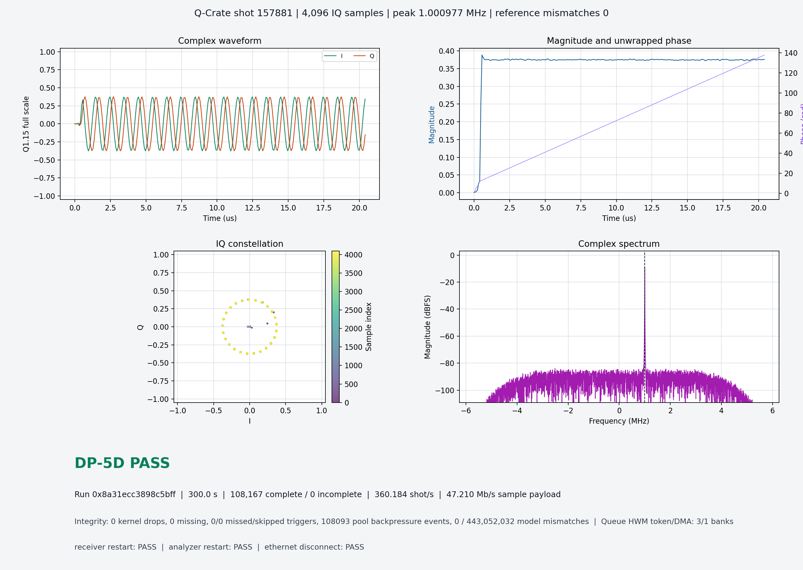

# DP-5D Instrument Acceptance

## Objective

DP-5D closes the first Q-Crate reference application with measured evidence,
not a console demonstration. It accepts the Networked Pulsed-IQ Analyzer v1
only when a five-minute hardware-triggered run remains bit-exact and when
receiver, analyzer, and Ethernet interruptions are visible and recoverable.

The acceptance layer does not enter the acquisition path:

```text
KV260 DMA -> qcrate-streamer -> UDP -> qcrate-recorder -> QCRUN/QIDX
                                      hard integrity boundary       |
                                                                    +-> analyzer
                                                                    +-> acceptance
```

`qcrate-recorder` remains the only process that decides whether sample bytes
belong to a COMPLETE measurement. The GUI and acceptance program are readers.
Closing them, rendering slowly, or restarting them cannot delay UDP ingest or
change recorder ownership.

## Evidence Model

The final report combines independent artifacts:

| Artifact | Owner | Evidence |
|---|---|---|
| `packets.qcdp` | recorder | immutable received-datagram journal |
| `shots.qidx` | recorder | committed COMPLETE or quarantined INCOMPLETE shots |
| `samples.iq16` | recorder | sample extents published only after integrity checks |
| `run.json` | recorder | duration, CPU, throughput, packet and socket health |
| `sender.json` | KV260 sender | DMA queues, stalls, starvation, skipped triggers, CPU |
| `analyzer-sessions.jsonl` | analyzer | independent GUI open/close/restart lifecycle |
| `dp5d-faults.json` | acceptance tool | evidence-derived disruption/recovery results |
| `dp5d-acceptance.json` | acceptance tool | final machine-readable verdict |
| `dp5d-acceptance.png` | acceptance tool | scientific plots and compact health summary |

Data Plane v1 and QIDX v1 are unchanged. The added JSON is operational
telemetry and can evolve independently of the frozen wire and storage formats.

## Build And Deploy

No Vivado, Vitis, device-tree, kernel, or DMA-driver rebuild is required.
Build the host recorder locally:

```bash
python3 host/data_plane/build_recorder.py
```

Cross-compile the updated sender in the existing PetaLinux project:

```bash
source /tools/Xilinx/PetaLinux/2024.2/settings.sh
cd /tools/fpga_projects/qcrate/kv260/linux/petalinux/qcrate-kv260
petalinux-build -c qcrate-streamer
```

Then rebuild and deploy the image with the established PetaLinux flow. These
are intentionally user-run because they are long operations:

```bash
cd /tools/fpga_projects/qcrate
python3 kv260/linux/petalinux/scripts/petalinux_flow.py build
python3 kv260/linux/petalinux/scripts/petalinux_flow.py package
python3 kv260/linux/petalinux/scripts/petalinux_flow.py deploy --device /dev/mmcblk0
```

Confirm that the board has the accepted sequence image at
`/home/petalinux/qcrate/two_channel_demo.qseq`. Recreate and transfer it when
needed:

```bash
python3 host/sequence_compiler/qcrate_sequence.py compile \
  host/sequence_compiler/examples/two_channel_demo.json \
  /tmp/two_channel_demo.qseq
scp /tmp/two_channel_demo.qseq \
  petalinux@192.168.1.93:/home/petalinux/qcrate/two_channel_demo.qseq
```

## Five-Minute Soak

The tracked `run` command loads the sequence, starts the compiled recorder,
opens the live analyzer, runs the KV260 sender over SSH, retrieves its report,
and generates the initial acceptance JSON and PNG:

```bash
RUN="build/acceptance/dp5d-soak-$(date -u +%Y%m%dT%H%M%SZ)"
python3 host/acceptance/qcrate_acceptance.py run \
  --board petalinux@192.168.1.93 \
  --destination 192.168.1.92 \
  --source 192.168.1.93 \
  --duration-seconds 300 \
  --banks 4 \
  --rate-mbps 420 \
  --output "$RUN"
```

The sender, sequence loader, and sender-report retrieval share one visible SSH
pseudo-terminal and one `sudo` invocation. This limits a run to one SSH login
and one board-side privilege escalation; password prompts remain visible and
cannot hide inside a captured log. SSH keys are recommended for repeatable host
authentication. With a key installed, only the board's `sudo` password is
normally requested. The latter is labeled `[KV260 sudo] password:` to
distinguish it from the preceding SSH login. `--no-gui` provides the same
acquisition and verdict on a headless host.

The recorder allows up to 300 seconds for interactive authentication before
the first datagram. This is a startup allowance, not part of the measured soak
duration. Override it with `--startup-timeout-seconds` when needed. The live
analyzer treats an initialized but empty run as `recording` and waits for the
first committed QIDX header; offline readers continue to reject truncated
indexes.

The sender stops only after the requested duration has elapsed and the current
shot has completed. It then drains the token queue, releases every DMA bank,
and emits END_OF_STREAM. Therefore the reported capture duration is at least
300 seconds rather than a best-effort process timeout.

A valid clean run prints `PENDING`, because fault acceptance is not yet
complete. Its `clean_soak_pass` field must be `true`. `FAIL` means the run must
be investigated rather than promoted.

## Fault Acceptance

Use short 30-60 second runs for fault injection. Preserve every disrupted run;
it is evidence, not trash. A disruption must never finish with
`run.json.complete=true`. Its recovery must use a new run ID and finish cleanly.

### Analyzer close and restart

Start a 60-second run with the default GUI. Close the analyzer while shots are
still arriving, then reopen the same run from another terminal:

```bash
python3 host/analyzer/qcrate_analyzer.py "$RUN" \
  --session-log "$RUN/analyzer-sessions.jsonl"
```

After the run completes, require two distinct GUI sessions and an intact run:

```bash
python3 host/acceptance/qcrate_acceptance.py assess-fault analyzer_restart \
  --faults build/acceptance/dp5d-faults.json \
  --run "$RUN" \
  --session-log "$RUN/analyzer-sessions.jsonl"
```

### Receiver stop and fresh restart

Start a 60-second acceptance run. From a second host terminal, stop only the
recorder after several shots have appeared:

```bash
pkill -TERM -x qcrate-recorder
```

The first command is expected to fail and preserve a non-COMPLETE run. Start a
new 30-second run after the sender has stopped, then assess both artifacts:

```bash
python3 host/acceptance/qcrate_acceptance.py assess-fault receiver_restart \
  --faults build/acceptance/dp5d-faults.json \
  --disrupted-run "$DISRUPTED_RUN" \
  --recovery-run "$RECOVERY_RUN"
```

### Ethernet disconnect and recovery

Start another 60-second run, physically disconnect the KV260 Ethernet cable
after several shots, wait about ten seconds, and reconnect it. The disrupted
run must remain non-COMPLETE. Once SSH and the link have recovered, start a
fresh 30-second run and assess it:

```bash
python3 host/acceptance/qcrate_acceptance.py assess-fault ethernet_disconnect \
  --faults build/acceptance/dp5d-faults.json \
  --disrupted-run "$DISRUPTED_RUN" \
  --recovery-run "$RECOVERY_RUN"
```

If the SSH process does not recover after link restoration, interrupt the host
command, verify over UART that no `qcrate-streamer` remains, and retain the
recorder bundle. Transparent continuation is deliberately not required.

## Final Verdict

Re-evaluate the five-minute soak after all three fault cases pass:

```bash
python3 host/acceptance/qcrate_acceptance.py evaluate "$SOAK_RUN" \
  --minimum-duration 300 \
  --faults build/acceptance/dp5d-faults.json
```

Final `PASS` requires:

- at least 300 seconds of repeated hardware-triggered acquisition;
- matching sender and recorder shot totals with no incomplete or skipped IDs;
- strictly increasing hardware timestamps;
- zero DMA errors, missed/skipped triggers, missing packets, conflicting
  packets, kernel receive drops, and continuity errors;
- CRC agreement for every published shot;
- every published IQ word matching the canonical bit-exact DSP model;
- evidence-based PASS for receiver restart, analyzer restart, and Ethernet
  disconnect/recovery.

`starvation_events` is the stable UAPI name for occasions when no pool bank was
`FREE`. In the software-triggered reference application this is safe, explicit
backpressure: the driver stops rearming and never overwrites an unread bank.
The count remains acceptance evidence and a performance signal, but is not data
loss. A missed/skipped trigger or DMA error remains fatal.

Copy the resulting report image into `host/acceptance/images/` only after real
hardware returns final PASS. That image and the measured summary then become
the tracked DP-5D acceptance evidence.

## Accepted KV260 Result

Networked Pulsed-IQ Analyzer v1 reached **ACCEPTED** status on 2026-09-05. The
five-minute run and all three independent recovery cases passed:

| Measurement | Accepted result |
|---|---:|
| Sustained acquisition | 300.001179 seconds |
| Complete / incomplete shots | 108,167 / 0 |
| Bit-exact IQ words | 443,052,032 |
| Reference mismatches | 0 |
| Missing, malformed, or conflicting packets | 0 |
| Kernel receive drops | 0 |
| Missed/skipped triggers and DMA errors | 0 |
| Sample / UDP payload rate | 47.210 / 50.898 Mb/s |
| Analyzer restart | PASS |
| Receiver restart | PASS |
| Ethernet disconnect and fresh-run recovery | PASS |



The portable machine-readable result is tracked in
[`evidence/dp5d-kv260-accepted.json`](evidence/dp5d-kv260-accepted.json). Raw
QCRUN data remains outside Git because the accepted `samples.iq16` alone is
1,772,208,128 bytes.

## Lightweight Tests

These checks do not invoke AMD tools or board hardware:

```bash
MPLCONFIGDIR=/tmp/qcrate-matplotlib \
python3 -m unittest discover -s host/acceptance/tests -v

python3 common/data_plane/run_tests.py
```

The tests cover verdict gating, bit-exact and post-recording corruption
detection, recorder socket fault cases, strict C builds, and protocol
regressions. Real duration, CPU, queue, link-loss, and restart evidence can
only be accepted on the KV260 and host pair.
