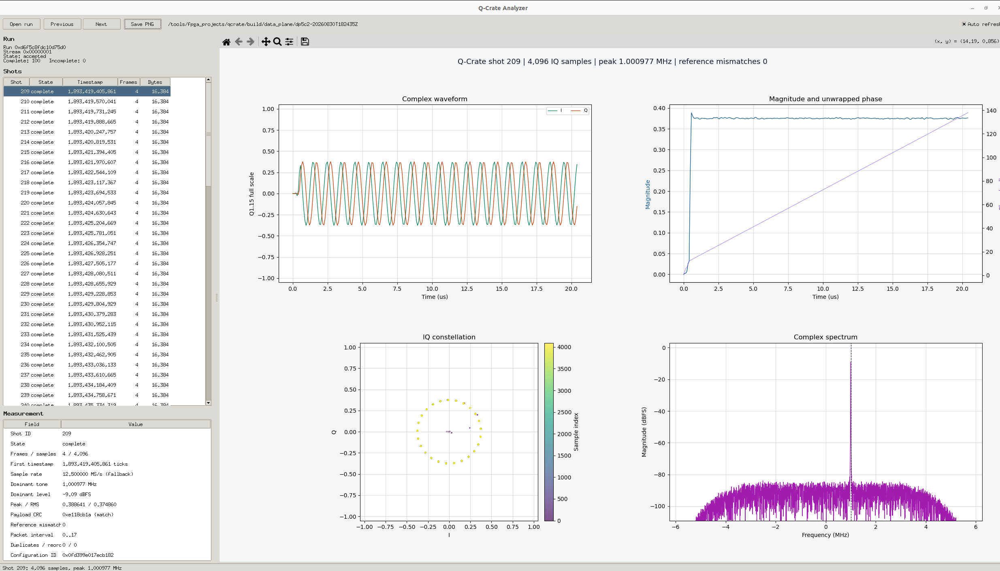
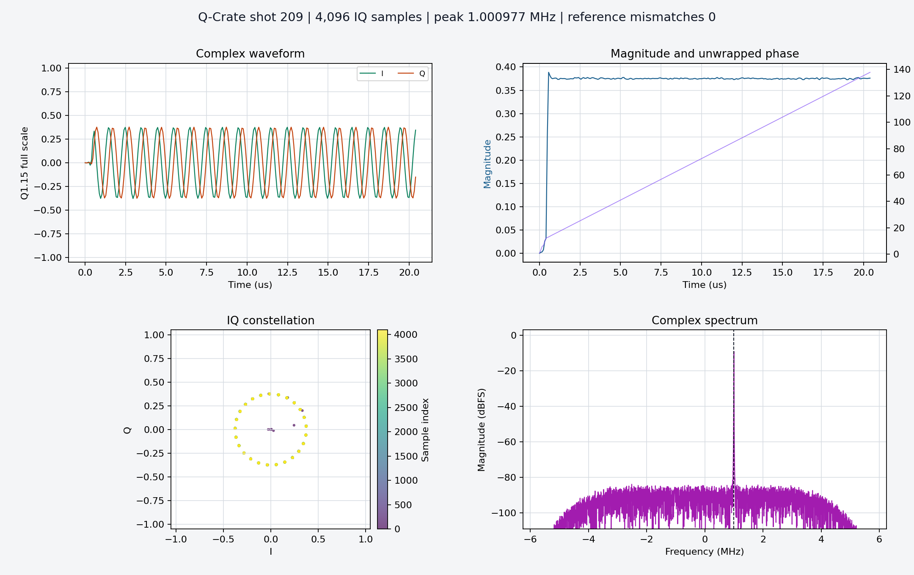

# Q-Crate Run Analyzer

## Objective

`qcrate-analyzer` turns a recorded Data Plane run into an inspectable
instrument measurement. It is the DP-5C3 presentation layer of the Networked
Pulsed-IQ Analyzer reference application: operators can move across repeated
shots, identify quarantined acquisitions, inspect timestamps and packet
integrity, and examine the actual captured waveform and spectrum.

```text
KV260 triggered acquisition
          |
          v
qcrate-recorder (hard ingest and integrity boundary)
          |
          +--> packets.qcdp
          +--> samples.iq16
          +--> shots.qidx
          +--> run.json
                    |
                    v
             qcrate-analyzer
          shot browser + plots + export
```

The GUI is intentionally outside the recorder process. Plot rendering, model
comparison, a slow desktop, or a closed window cannot delay UDP reception or
change sample ownership. The analyzer consumes only COMPLETE QIDX extents;
INCOMPLETE records remain visible as error events but never expose sample
bytes.

## Responsibilities

The application provides:

- live run state, elapsed time, shot and payload rates, and
  complete/incomplete shot counts;
- packet integrity, kernel drop, skipped-shot, queue high-water, DMA
  stall/starvation, and host/KV260 CPU metrics when final manifests are
  available;
- a bounded 512-record visual window containing shot identity, state,
  timestamp, frame count, and published bytes;
- previous/next navigation across the complete run, direct Shot ID lookup,
  and PNG export;
- captured I/Q time waveforms, magnitude, unwrapped phase, constellation, and
  centered complex spectrum;
- dominant tone, level, peak/RMS magnitude, CRC, packet interval, duplicate
  and reorder counts, and configuration identity;
- exact comparison against the tracked DSP model when the run's `config_id`
  identifies the canonical 1 MHz Q-Crate profile;
- one-second append-only refresh while a recorder is still committing QIDX
  records.

The time plots show the first 256 samples so individual cycles remain visible.
The FFT, CRC, model comparison, peak/RMS values, and sample count use the
entire shot.

## Architecture

[`qcrate_run.py`](qcrate_run.py) is the dependency-free storage reader. Its
strict `RunBundle` reader validates QIDX magic, version, sizes, reserved
fields, issue bits, shot order, publication state, and every sample-file
extent before returning a complete run. Acceptance and headless reporting use
this whole-run path.

The interactive application uses the complementary `RunIndex` reader. It
keeps file descriptors open, scans each committed QIDX record once for health
accounting, reads later append-only records incrementally, and performs
random-access reads with `pread`. Only 1,024 decoded records are cached and at
most 512 are represented as Tk rows. The selected shot is the only sample
extent loaded from `samples.iq16`. A multi-gigabyte acquisition therefore does
not require multi-gigabyte memory or an unbounded number of GUI objects.

[`qcrate_analyzer.py`](qcrate_analyzer.py) contains numerical analysis,
plotting, headless export, and the Tk desktop application. NumPy and Matplotlib
are reused from the bit-accurate DSP environment. Tk is supplied by the host
Python installation rather than PyPI.

The current live mode polls append-only QIDX once per second. It follows the
newest shot while the operator remains at the tail; selecting an older shot
freezes that selection for comparison. Previous and Next cross window
boundaries transparently, and the Shot ID field performs a binary search over
the fixed-size index. Selection rendering is debounced so holding an arrow key
does not calculate and redraw every intermediate spectrum. This preserves the
recorder boundary and requires no second IPC protocol. A future event
notification socket can reduce latency without changing QIDX or analyzer
ownership.

The instrument-health panel is derived from committed QIDX records during a
run. Recorder CPU, exact UDP throughput, and sender DMA/queue metrics appear
after the atomic `run.json` and `sender.json` reports arrive. Their temporary
absence is displayed as pending rather than guessed.

## Setup

Use Python 3.10 or newer. The pinned numerical and plotting requirements are
shared with the DSP viewer:

```bash
python3 -m venv .venv
. .venv/bin/activate
python3 -m pip install -r host/analyzer/requirements.txt
```

On Debian or Ubuntu, install Tk from the distribution if `import tkinter`
fails:

```bash
sudo apt install python3-tk
```

## Open A Run

Pass a run directory directly:

```bash
python3 host/analyzer/qcrate_analyzer.py \
  build/data_plane/dp5c2-20260830T182435Z
```

Or launch without an argument and use **Open run**:

```bash
python3 host/analyzer/qcrate_analyzer.py
```

The application refreshes an open run automatically. Disable **Auto refresh**
when examining a fixed bundle. **Save PNG** exports the currently selected
shot using the same complete-shot analysis shown on screen. Enter a decimal or
`0x`-prefixed identity in **Shot ID** and press Enter or **Go** to navigate
directly in a long acquisition.

The first DP-5C2 acceptance bundle predates stream metadata in `run.json`.
For that bundle the analyzer visibly reports `12.500000 MS/s (fallback)`. New
recorder manifests carry the exact rational sample and timestamp rates and are
reported as `run metadata`. Override an old run only when its actual rate is
known:

```bash
python3 host/analyzer/qcrate_analyzer.py RUN_DIR \
  --sample-rate-hz 12500000
```

## Headless Report

Generate the same four-panel measurement without opening a window:

```bash
python3 host/analyzer/qcrate_analyzer.py RUN_DIR \
  --shot 209 \
  --snapshot build/data_plane/shot-209.png
```

Omit `--shot` to export the first complete shot. Headless mode is useful for
automated reports, remote systems, and future PYNQ notebooks.

DP-5D can append GUI lifecycle evidence without placing control traffic in the
recorder:

```bash
python3 host/analyzer/qcrate_analyzer.py RUN_DIR \
  --session-log RUN_DIR/analyzer-sessions.jsonl
```

See [DP-5D instrument acceptance](../acceptance/README.md) for the five-minute
soak, restart tests, and final machine-readable verdict.

## Accepted DP-5C2 Run



The desktop view above is the visually accepted DP-5C3 application opened on
the complete 100-shot hardware run. The left side preserves run and shot
context while the plotting area remains large enough for repeated waveform
inspection. Shot selection, previous/next navigation, automatic refresh, and
PNG export were all exercised on the development host.



This report is generated from shot 209 of the actual 100-shot DP-5C2 KV260
run. The shot contains 4,096 Q1.15 IQ samples. Its complete payload matches the
tracked bit-accurate DSP model with zero mismatches, and the spectrum locates
the expected translated tone at the nearest 4,096-point FFT bin,
1.000977 MHz.

## Focused Tests

Run the storage and analysis tests without opening a GUI:

```bash
MPLCONFIGDIR=/tmp/qcrate-matplotlib \
python3 -m unittest discover -s host/analyzer/tests -v
```

The tests cover complete and incomplete records, sample extent rejection,
legacy sample-rate fallback, IQ tone analysis, CRC agreement, headless PNG
generation, append-only index refresh, partial-record publication, random
access, binary Shot ID lookup, and bounded caching with a synthetic
20,000-shot run. Visual desktop acceptance is separate because window-system
availability and scaling are host properties.

## Portability

The QIDX reader and analysis functions are platform-independent Python. A
PYNQ-Z2 deployment should reuse them while replacing the Tk shell with a
Jupyter or browser presentation appropriate to PYNQ. This avoids copying
binary parsing or DSP interpretation into a board-specific UI and keeps the
same run bundle readable on a workstation, PYNQ board, or automated server.
