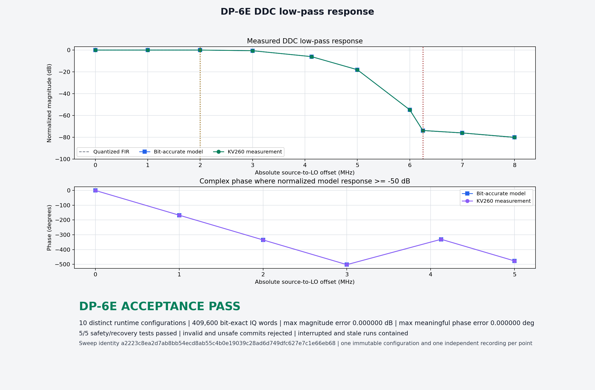

# Q-Crate experiment profiles

DP-6 moves Q-Crate from one compiled experiment to runtime-selectable,
repeatable experiments. DP-6A defines the contract before adding writable RTL:
an operator supplies physical values, the compiler resolves them into the exact
integers hardware will consume, and deterministic identities bind those values
to the numerical, acquisition, and timing contracts.

This directory contains the human profile schema, compiler, examples, and
focused tests. DP-6B implements the corresponding PL shadow registers and
atomic activation mailbox. It deliberately does not yet expose direct host
configuration: DP-6C gives R5 semantic ownership, and DP-6D exposes that owned
workflow through the existing control tools.

## Experiment definition

A `qcrate-experiment-profile-v1` document has four parts:

| Part | Purpose |
|---|---|
| `dsp` | Synthetic input and DDC LO frequency, phase, amplitude, and repeatable noise |
| `acquisition` | Existing DSP stream mode, words per frame, and frames per shot |
| `sequence` | Repository-relative pulse-sequence source compiled into the shot timing image |
| `name` | Human-readable metadata; deliberately excluded from identity |

The source schema is
[`qcrate_experiment_profile.schema.json`](qcrate_experiment_profile.schema.json).
The compiler performs the same checks directly, so no separate JSON Schema
package is required.

The current numerical contract remains fixed at a 200 MS/s input rate, a
decimation factor of 16, and a 12.5 MS/s complex output. Those are properties
of the implemented DSP architecture rather than runtime settings. The initial
profile intentionally does not select arbitrary source providers or feature
flags.

## Resolution and identity

`qcrate_profile.py compile` converts human decimal values into:

- 32-bit NCO phase increments and initial phases;
- signed Q1.15 amplitudes and a 16-bit nonzero noise seed;
- the existing integer frame contract;
- the exact compiled sequence image hash, CRC, event count, and tick rate;
- ordered future APB shadow-register writes; and
- deterministic DSP and full-profile identities.

Canonical identity input is sorted, whitespace-independent JSON containing only
resolved semantics. File paths and display names do not affect identity.
The encoding is UTF-8/ASCII JSON with sorted keys and compact separators. The
DSP SHA-256 covers the resolved DSP bundle and numerical contract; its first
eight digest bytes, interpreted in network display order, form the 64-bit ID.

The 64-bit **DSP configuration ID** identifies the active DSP integers plus the
fixed numerical/table contract. It fits the existing Data Plane v1 `config_id`
field and is intended for fast correlation, not as a cryptographic signature.
The complete DSP SHA-256 is retained in the resolved document.

The **experiment profile SHA-256** additionally binds acquisition framing and
the compiled pulse-sequence image. It is the durable identity recorded in run
metadata. Changing only frame count leaves the DSP ID unchanged but changes the
full profile identity. Every LO point in a future sweep therefore receives a
different resolved DSP ID and full profile identity.

## Atomic ownership contract

The minimal future register definition is
[`common/config/qcrate_dsp_registers.json`](../../common/config/qcrate_dsp_registers.json).
Page `0x3000` contains shadow fields, active readback fields, `COMMIT`,
`DISCARD`, status, rejection reason, and an active generation counter. This is
an explicit cross-language contract, not a general register-generation system.

The intended lifecycle is:

```text
host profile -> R5 semantic validation -> APB shadow writes
             -> PL structural/state check -> coherent CDC commit
             -> all active DSP fields change together at an idle boundary
```

R5 is authoritative for semantic policy. The PL enforces only register widths,
reserved bits, commit integrity, and safe state boundaries. A commit while the
instrument is armed or running is rejected; it is not silently deferred.

DP-6 intentionally uses one active configuration per recorded run. Retuning
closes the current run, commits a new profile, and starts a new run. The
identity model and wire protocol do not prevent a later profile-table or
per-shot implementation.

## Commands

Resolve one profile and inspect its exact values without writing a file:

```bash
python3 host/experiment_profiles/qcrate_profile.py show \
  host/experiment_profiles/examples/lo_29mhz.json
```

Compile a durable resolved profile:

```bash
python3 host/experiment_profiles/qcrate_profile.py compile \
  host/experiment_profiles/examples/lo_29mhz.json \
  build/experiments/lo_29mhz.resolved.json
```

Run the DP-6A visible proof. The same 30 MHz synthetic source must appear near
1.0 MHz with a 29 MHz LO and near 1.5 MHz with a 28.5 MHz LO:

```bash
python3 host/experiment_profiles/qcrate_profile.py prove \
  host/experiment_profiles/examples/lo_29mhz.json \
  host/experiment_profiles/examples/lo_28_5mhz.json \
  --output build/experiments/dp6a-proof.json
```

Run the focused contract tests:

```bash
python3 -m unittest discover -s host/experiment_profiles/tests -v
```

No Vivado, Vitis, PetaLinux, or board build is required for DP-6A.

## DP-6A accepted proof

The tracked [proof summary](examples/dp6a-proof.json) records the model result:

| Profile | LO tuning word | DSP config ID | Resolved baseband | Model FFT peak |
|---|---:|---:|---:|---:|
| 29 MHz LO | `0x251eb852` | `0x5db4fb578b27b09f` | 999999.978 Hz | 999630.906 Hz |
| 28.5 MHz LO | `0x247ae148` | `0xaf46287bb969ed24` | 1499999.966 Hz | 1500984.252 Hz |

Both FFT peaks are within one 3075.787 Hz bin of the frequency predicted from
the exact tuning words. The corresponding [resolved profiles](examples/resolved/)
are tracked as readable golden contract artifacts.

## DP-6B hardware boundary

The implemented `0x3000` APB page stores a complete shadow bundle in the
100 MHz control domain. `COMMIT` snapshots that bundle into an acknowledged
`xpm_cdc_handshake` request. The 200 MHz destination waits an additional clock
before checking the experiment boundary, then either activates every field and
increments `ACTIVE_GENERATION` in one edge or rejects the request without
changing any active field. A second acknowledged handshake returns the result
and coherent active readback to the control domain.

Safe activation requires both the stream engine and sequence engine to be idle
and unarmed, with no visible command pulse. This closes the race between a
configuration commit and a simultaneous arm/start command. Rejection is
explicit and never queues a hidden deferred update.

The stream engine snapshots the active 64-bit DSP configuration ID when a
capture starts. The captured identity is returned at stream offsets `0x04c`
and `0x050`, independently of later shadow edits. DP-6C uses this hardware
boundary through R5 rather than granting Linux applications unrestricted
semantic ownership.

For both the active and captured 64-bit identities, software reads the low
word first; that access latches the corresponding high word for the following
read. A coherent active-bundle inspection also reads `ACTIVE_GENERATION`
before and after the fields and retries if the generation changed.

## DP-6C R5-owned application

DP-6C extends the fixed 64-byte RPMsg contract with typed stage, validate,
commit, status, and recovery operations. R5 is the only normal writer of the
DSP shadow page and verifies stream framing, every shadow word, PL acceptance,
the active generation, and active readback. This preserves the profile
lifecycle across Linux applications without making R5 a generic MMIO proxy.

Convert a tracked resolved profile into the exact target command:

```bash
python3 host/experiment_profiles/qcrate_profile.py command \
  host/experiment_profiles/examples/resolved/lo_29mhz.resolved.json
```

The output is a `qcrate-control config-apply` invocation containing the stable
64-bit ID and the nine resolved DSP/acquisition values. It may be inspected,
logged, or executed on the target. If this script and the resolved profile are
present on the target, the equivalent direct operation is:

```bash
sudo python3 qcrate_profile.py apply lo_29mhz.resolved.json
sudo qcrate-control config-status
```

Retuning is fail-closed: the sequence and stream engines must be idle, and a
rejected or timed-out PL commit restores the previous stream geometry. Use
`qcrate-control config-recover` to abandon a staged transaction explicitly;
it never rolls back or modifies an already active configuration.

## DP-6D end-to-end experiment

DP-6D carries one resolved profile through the complete measurement path:

```text
resolved profile -> R5 validate/commit -> PL active configuration
       |                                      |
       |                              captured configuration ID
       v                                      v
durable run artifact <- recorder <- UDP STREAM_INFO <- DMA result
       |
       +-> ID-selected bit-exact model -> analyzer image
```

`qcrate_experiment.py` is the normal host orchestration command. It starts the
independent recorder, verifies that the board's compiled sequence image has the
profile's SHA-256, uses one SSH/sudo session to apply the profile and acquire
shots, copies the exact resolved profile into the run, checks every published
IQ word, and renders `measurement.png`. Recorder integrity remains the hard
ingest boundary; plotting starts only after a complete run has passed.

Build the host recorder once if it is not already present:

```bash
python3 host/data_plane/build_recorder.py
```

Run the 29 MHz LO experiment:

```bash
RUN=build/experiments/dp6d-lo29-$(date -u +%Y%m%dT%H%M%SZ)
python3 host/experiment_profiles/qcrate_experiment.py \
  --profile host/experiment_profiles/examples/resolved/lo_29mhz.resolved.json \
  --board petalinux@192.168.1.93 \
  --destination 192.168.1.92 \
  --source 192.168.1.93 \
  --output "$RUN" \
  --shots 10 --banks 4 --rate-mbps 420 --gui
```

Without rebuilding the FPGA, firmware, or Linux image, repeat with the 28.5
MHz LO profile:

```bash
RUN=build/experiments/dp6d-lo28_5-$(date -u +%Y%m%dT%H%M%SZ)
python3 host/experiment_profiles/qcrate_experiment.py \
  --profile host/experiment_profiles/examples/resolved/lo_28_5mhz.resolved.json \
  --board petalinux@192.168.1.93 \
  --destination 192.168.1.92 \
  --source 192.168.1.93 \
  --output "$RUN" \
  --shots 10 --banks 4 --rate-mbps 420 --gui
```

The two runs must carry IDs `0x5db4fb578b27b09f` and
`0xaf46287bb969ed24`, respectively. Their dominant baseband tones should be
near 1.0 MHz and 1.5 MHz, and both commands must report zero bit-exact
mismatches. Each generated run contains the profile, sender/recorder evidence,
indexed samples, packet journal, and measurement image.

### Target deployment for DP-6D

The DMA ABI is now version 2. Rebuild and deploy one coherent image using the
established PetaLinux flow; its dependency graph rebuilds the changed DMA
driver, DMA tools, and streamer together:

```bash
python3 kv260/linux/petalinux/scripts/petalinux_flow.py all \
  --device /dev/mmcblk0
```

No Vivado or Vitis rebuild is required because DP-6D consumes the capture-ID
registers and R5 configuration-status API already accepted in DP-6B/DP-6C.

## DP-6E reproducible response sweep

DP-6E turns runtime retuning into a measurement rather than a sequence of
manually selected screenshots. Its machine-readable contract is
[`qcrate_lo_sweep.schema.json`](qcrate_lo_sweep.schema.json). The tracked
[`lo_sweep.json`](examples/lo_sweep.json) specification keeps the 30 MHz
synthetic source fixed and moves the LO through ten explicit offsets covering:

| Region | Source-to-LO offsets |
|---|---|
| Passband | 0, 1, and 2 MHz |
| Transition band | 3, 4.125, 5, and 6 MHz |
| Stopband | 6.25, 7, and 8 MHz |

The base profile disables synthetic noise so attenuation in the deep stopband
measures the DDC/FIR response rather than the configured noise floor. This is
an intentional characterization profile, not a claim that a physical input is
noiseless.

`qcrate_sweep.py` first resolves every point atomically on the host. Each point
must have a unique LO tuning word, DSP configuration ID, and full profile
identity before the board is touched. Acquisition then uses the accepted
single-experiment path and creates a fresh Data Plane v1 run for every point:

```text
tracked sweep specification
  -> atomic plan + one resolved profile per LO point
  -> R5-owned commit -> independent triggered run
  -> recorder integrity + captured configuration identity
  -> bit-exact IQ check + coherent complex estimator
  -> magnitude/phase response + acceptance evidence
```

The coherent estimator discards the first 32 decimated outputs, which is later
than the first complete 217-tap FIR window at output index 13. It projects the
remaining complex samples onto the exact realized source-to-LO frequency.
Frequencies above the 12.5 MS/s output Nyquist limit are projected at their
known aliased output frequency while the FIR response remains labeled by the
unaliased input offset. Magnitude is normalized to the designated DC reference.
Phase is accepted only where the modeled normalized response is at least
-50 dB; below that floor DP-6E reports attenuation but does not assign physical
meaning to phase.

### Plan without hardware

Planning is a lightweight way to inspect all generated identities and values:

```bash
SWEEP=build/experiments/dp6e-$(date -u +%Y%m%dT%H%M%SZ)
python3 host/experiment_profiles/qcrate_sweep.py plan \
  --spec host/experiment_profiles/examples/lo_sweep.json \
  --output "$SWEEP"
```

Plan publication is atomic. A malformed point, duplicate ID/tuning word,
incorrect frequency-region label, or stale base profile leaves no partial
plan at the requested output path.

### Acquire the sweep on KV260

Either use a new output path directly or continue the planned path above:

```bash
python3 host/experiment_profiles/qcrate_sweep.py run \
  --spec host/experiment_profiles/examples/lo_sweep.json \
  --output "$SWEEP" \
  --board petalinux@192.168.1.93 \
  --destination 192.168.1.92 \
  --source 192.168.1.93 \
  --shots 10 --banks 4 --rate-mbps 420
```

The command starts and closes the independent recorder once per point. Sweep
execution defaults to unattended access and fails before point one unless both
SSH-key authentication and the Q-Crate target device policy are active. It
never collects, stores, or forwards either password. OpenSSH multiplexing
reuses the authenticated transport while retaining a separate command and
recording boundary for every sweep point.

Configure the host key once:

```bash
test -f "$HOME/.ssh/id_ed25519" || ssh-keygen -t ed25519
ssh-copy-id petalinux@192.168.1.93
ssh -o BatchMode=yes petalinux@192.168.1.93 true
```

The PetaLinux image installs `qcrate-access`, creates a dedicated `qcrate`
group, adds the `petalinux` operator to it, and grants that group `0660` access
only to `/dev/qcrate-dma` and the `qcrate-control` RPMsg endpoint. Q-Crate
acquisition therefore needs neither root nor a passwordless shell. After
deploying an image containing this policy, verify it from a new login:

```bash
ssh petalinux@192.168.1.93 'id; stat -c "%A %U %G %n" /dev/qcrate-dma /dev/rpmsg*; qcrate-control config-status'
```

For an older image, append `--interactive-auth` to `qcrate_sweep.py run` and
`qcrate_sweep_acceptance.py`. This retains the prior SSH and `sudo` prompts but
is intentionally unsuitable for a large unattended sweep.

If execution is interrupted, rerun the same command with `--resume`. Already
verified points are skipped. An incomplete or invalid point directory is
renamed with an `.interrupted-NN` suffix before a fresh run starts; unread or
failed evidence is never overwritten silently.

The sweep phase writes `dp6e-sweep.json` and `dp6e-sweep.png`. It requires all
point runs to be complete and integrity-clean, all recorded configuration IDs
to match their resolved profiles, and every IQ word to match the identity-
selected bit-accurate model. In the deep stopband only magnitude is judged.

### Safety and recovery acceptance

After the sweep passes, run the closing acceptance command:

```bash
python3 host/experiment_profiles/qcrate_sweep_acceptance.py \
  --sweep "$SWEEP" \
  --board petalinux@192.168.1.93 \
  --destination 192.168.1.92 \
  --source 192.168.1.93 \
  --banks 4 --rate-mbps 420
```

One target session verifies that R5 rejects an invalid amplitude, rejects a
commit while the sequencer is armed, and retains staged state across separate
`qcrate-control` processes. The host then terminates a real recorder before it
receives data, preserves that interrupted run, starts a fresh one-shot
experiment, and proves that the accepted recording cannot be verified against
a stale resolved profile.

Only this second phase can create `dp6e-acceptance.json` and
`dp6e-acceptance.png`. Final `PASS` therefore means the scientific sweep,
configuration provenance, bit-exact data, unsafe-transition rejection,
interrupted-run recovery, and stale-ID detection all passed together.

DP-6E adds no target binaries and requires no FPGA or OS rebuild after the
accepted DP-6D deployment.

### Accepted KV260 result

DP-6E passed on real KV260 hardware on 12 September 2026. Ten runtime LO
configurations measured the DDC passband, transition band, and stopband without
rebuilding or reloading the FPGA or operating system. All 100 triggered shots
and 409,600 recorded IQ words matched the configuration-selected bit-accurate
model. Configuration IDs were distinct, magnitude and meaningful phase matched,
and all five invalid-transition, restart, interrupted-run, and stale-identity
checks passed.


