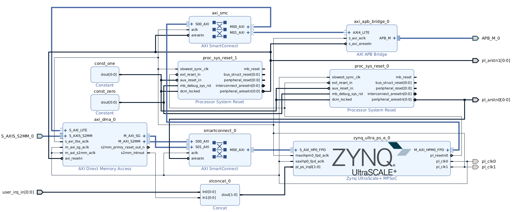

# KV260 hardware notes

## APB Verilator test

This lightweight simulation checks the APB fabric and system-register page without Vivado. It does not compile `qcrate_core.sv` yet because later stream, CDC, and IRQ modules are still planned work.

Build and run from the repository root:

```bash
mkdir -p build/verilator/qcrate_apb_tb

CCACHE_DISABLE=1 verilator --binary --timing -Wall \
  --top-module qcrate_apb_tb \
  --Mdir build/verilator/qcrate_apb_tb \
  kv260/hw/tb/qcrate_apb_tb.sv \
  kv260/hw/rtl/qcrate_apb_fabric.sv \
  kv260/hw/rtl/qcrate_sys_regs.sv

./build/verilator/qcrate_apb_tb/Vqcrate_apb_tb
```

Expected result:

```text
PASS: qcrate_apb_tb
```

The test covers system identity reads, scratch write/readback, setup-only write rejection, back-to-back accesses, writes to read-only registers, unmapped system offsets, unmapped APB pages, and stream-page routing through the fabric.

The Vivado BD sets the AXI/APB bridge `C_DPHASE_TIMEOUT` to `16`. The Xilinx
default is `0`, which means the bridge can wait indefinitely if the APB side
does not respond. A nonzero timeout is useful during bring-up because a broken
APB slave should not permanently hang an A53 Linux register read.

A faster syntax/lint-only check, useful while editing the APB fabric, is:

```bash
verilator --lint-only --timing \
  kv260/hw/rtl/qcrate_apb_fabric.sv \
  kv260/hw/rtl/qcrate_sys_regs.sv \
  kv260/hw/tb/qcrate_apb_tb.sv
```

Expected result: Verilator exits with code 0 and no `%Error` messages. This does not run the self-checking testbench; it only elaborates/lints the selected files.

## Block-design clock partition



*Current reproducible KV260 block design. The exported Tcl in `bd/design_1.tcl`
is the source of truth; this image is a visual reference.*

The control path runs entirely on `pl_clk1` at 100 MHz:

```text
PS M_AXI_HPM0_FPD -> control SmartConnect -> DMA AXI-Lite
                                         -> AXI/APB bridge -> qcrate_core
```

The stream and DMA payload path runs on `pl_clk0` at 200 MHz:

```text
qcrate_core AXI4-Stream -> AXI DMA S2MM -> data SmartConnect -> PS HP0/DDR
                              M_AXI_SG -> data SmartConnect -> PS HP0/DDR
```

The AXI DMA is the intentional boundary between these domains. Vivado detects
the different AXI-Lite and S2MM/SG clocks and configures the DMA IP in
asynchronous clock mode. Its single external `axi_resetn` is driven by the
slower 100 MHz control reset; the DMA IP handles its internal reset crossings.
An external AXI Clock Converter in the APB branch would be functionally valid,
but unnecessary because no control transaction needs to enter the 200 MHz
domain first.

Finite multi-frame capture enables AXI DMA scatter-gather with a 23-bit length
field. `M_AXI_S2MM` writes payload slots and `M_AXI_SG` fetches descriptors;
both are independent SmartConnect inputs sharing the existing HP0 DDR port.
Linux pre-arms one descriptor per frame before issuing a single stream `START`.
The optional AXI DMA control/status streams are explicitly disabled. They are
intended for sideband-aware packet systems such as Ethernet and are not part of
Q-Crate's `S_AXIS_S2MM` data contract.

## APB canary bitstream

The APB canary is a diagnostic build mode for board bring-up. It bypasses
`qcrate_core` in `qcrate_top.sv` and makes the top-level APB endpoint answer
every read with:

```text
0x51435254
```

This proves or disproves the path:

```text
A53 Linux -> PS AXI HPM -> control SmartConnect -> AXI/APB bridge -> qcrate_top APB pins
```

Build it from the development machine:

```bash
python3 scripts/build.py --stage all --define QCRATE_APB_CANARY
python3 scripts/package_xmutil.py \
  --dtg-repo /path/to/device-tree-xlnx \
  --keep-dts
```

After installing and loading the package on the KV260, run only one APB read:

```bash
sudo ~/qcrate/qcrate_apb.py read 0x0000
```

Expected result:

```text
0x51435254
```

Interpretation:

```text
canary read works    -> debug qcrate_core/APB register RTL next
canary read freezes  -> debug BD clock/reset/address/AXI/APB bridge path next
```

Return to the normal design by rebuilding without the define:

```bash
python3 scripts/build.py --stage all
```

### Processor-reset polarity

The Processor System Reset IP has inputs with different active levels:

```text
ext_reset_in       active-low in this BD because it is driven by PS pl_resetn0
aux_reset_in       active-low
mb_debug_sys_rst   active-high
dcm_locked         high means the clock is usable
```

Therefore, the inactive tie-offs are:

```text
constant 1 -> aux_reset_in and dcm_locked
constant 0 -> mb_debug_sys_rst
```

Do not tie `aux_reset_in` and `mb_debug_sys_rst` to the same constant. A zero on
both inputs permanently asserts the active-low auxiliary reset. The resulting
hardware symptom is an AXI master holding `ARVALID=1` while the reset
SmartConnect holds `ARREADY=0`, causing a Linux `/dev/mem` read to wait forever.

## Stream-register and IRQ Verilator test

This simulation checks the stream-control APB page and sticky interrupt controller in the 100 MHz control domain. It intentionally does not test command/status CDC; that architecture is decided separately.

Build and run from the repository root:

```bash
mkdir -p build/verilator/qcrate_stream_regs_irq_tb

CCACHE_DISABLE=1 verilator --binary --timing -Wall \
  --top-module qcrate_stream_regs_irq_tb \
  --Mdir build/verilator/qcrate_stream_regs_irq_tb \
  kv260/hw/tb/qcrate_stream_regs_irq_tb.sv \
  kv260/hw/rtl/qcrate_stream_regs.sv \
  kv260/hw/rtl/qcrate_irq_ctrl.sv

./build/verilator/qcrate_stream_regs_irq_tb/Vqcrate_stream_regs_irq_tb
```

Expected result:

```text
PASS: qcrate_stream_regs_irq_tb
```

The test covers configuration register reset and readback, `CONTROL` write-one-pulse command bits, `CONTINUOUS` storage, status bit layout, sticky IRQ events, IRQ enable masking, `IRQ_CLEAR` write-one-to-clear behavior, event-vs-clear precedence, writes to read-only registers, and unmapped stream-page errors.

## CDC Verilator test

The CDC RTL uses `qcrate_cdc_single` as the local wrapper for single-bit synchronizers. In Vivado builds this wrapper instantiates `xpm_cdc_single`; in Verilator it uses a small two-flop fallback because Verilator does not provide the Xilinx XPM library.

The multi-bit command and status buses are not synchronized bit-by-bit. They use toggle handshakes: the source holds the multi-bit bus stable, the toggle crosses through `qcrate_cdc_single`, and the destination copies the held bus after observing the synchronized toggle.

Build and run from the repository root:

```bash
mkdir -p build/verilator/qcrate_cdc_tb

CCACHE_DISABLE=1 verilator --binary --timing -Wall \
  --top-module qcrate_cdc_tb \
  --Mdir build/verilator/qcrate_cdc_tb \
  kv260/hw/tb/qcrate_cdc_tb.sv \
  kv260/hw/rtl/qcrate_cdc_single.sv \
  kv260/hw/rtl/qcrate_event_cdc.sv \
  kv260/hw/rtl/qcrate_command_cdc.sv \
  kv260/hw/rtl/qcrate_status_cdc.sv

./build/verilator/qcrate_cdc_tb/Vqcrate_cdc_tb
```

Expected result:

```text
PASS: qcrate_cdc_tb
```

The test covers sparse event pulse crossing, command mailbox delivery, command busy rejection, and coherent status snapshot refresh.

## Stream-engine Verilator test

This simulation checks the first AXI4-Stream pattern source used for DMA bring-up. The current MVP stream word is:

```text
TDATA[31:16] = frame ID
TDATA[15:0]  = sample index
TKEEP        = 4'b1111
TLAST        = final sample of a frame
```

Build and run from the repository root:

```bash
mkdir -p build/verilator/qcrate_stream_engine_tb

CCACHE_DISABLE=1 verilator --binary --timing -Wall \
  --top-module qcrate_stream_engine_tb \
  --Mdir build/verilator/qcrate_stream_engine_tb \
  kv260/hw/tb/qcrate_stream_engine_tb.sv \
  kv260/hw/rtl/qcrate_stream_engine.sv

./build/verilator/qcrate_stream_engine_tb/Vqcrate_stream_engine_tb
```

Expected result:

```text
PASS: qcrate_stream_engine_tb
```

The test covers one-word frames, multi-word finite frames, continuous mode, `TLAST`, `TKEEP`, held AXI4-Stream outputs during backpressure, graceful abort after the currently presented word is accepted, soft reset, and invalid start configuration.

`STREAM_MODE=0` selects this counter source and `STREAM_MODE=1` selects the
complete complex DSP chain documented in `rtl/dsp/README.md`. Other values are
invalid. `FRAME_LENGTH=0` is invalid. In finite mode, `FRAME_COUNT=0` is also
invalid. In continuous mode, `FRAME_COUNT` is ignored.

A lightweight Vivado parser check for the same area is:

```bash
source /tools/Xilinx/Vivado/2024.2/settings64.sh

xvlog --sv \
  kv260/hw/rtl/qcrate_stream_engine.sv \
  kv260/hw/tb/qcrate_stream_engine_tb.sv \
  kv260/hw/rtl/qcrate_core.sv
```

Expected result: each file is analyzed with no `ERROR` messages. This is not synthesis and does not prove timing closure.

If `xsim <snapshot> -R` fails in the generated Tcl launcher before HDL code
runs, the snapshot-local simulator kernel can be invoked directly:

```bash
LD_LIBRARY_PATH=/tools/Xilinx/Vivado/2024.2/lib/lnx64.o \
  xsim.dir/qcrate_apb_tb_sim/xsimk --R
```

This is a fallback launcher check. In the current environment it reports
`Simulation completed` in `xsim.dir/qcrate_apb_tb_sim/xsimkernel.log`, but it
does not print the testbench `$display` pass line to stdout. Use the Verilator
commands above for a clearer self-checking pass/fail result.

## ILA workflow

The block-design Tcl can create an optional System ILA without committing an
`.xci` or generated IP products. Enable it with `QCRATE_AXI_ILA`; builds without
that define contain no ILA.

The diagnostic ILA uses the 100 MHz `pl_clk1` control domain and records 2048
samples.
Its slots monitor:

```text
SLOT_0_AXI  PS M_AXI_HPM0_FPD -> control SmartConnect input
SLOT_1_AXI  control SmartConnect M00 -> AXI DMA registers
SLOT_2_AXI  control SmartConnect M01 -> AXI/APB bridge
probe0      proc_sys_reset_1/peripheral_aresetn
```

The ILA's own `resetn` is tied high. This is intentional: `probe0` remains
observable even when the control interconnect is held in reset.

Build a canary image with the ILA from the repository root. Use `--stage all`
because the define changes the generated block-design structure:

```bash
python3 scripts/build.py --stage all \
  --define QCRATE_APB_CANARY \
  --define QCRATE_AXI_ILA
```

Expected artifacts include:

```text
build/artifacts/qcrate_kv260.bit
build/artifacts/qcrate_kv260.ltx
build/artifacts/qcrate_kv260.xsa
```

Package and deploy the image through the existing `xmutil` workflow. After
`xmutil loadapp qcrate_kv260`, open Vivado Hardware Manager on the development
machine, connect to the KV260 over JTAG, select the programmed FPGA, and set its
probes file to `build/artifacts/qcrate_kv260.ltx`. Refresh the device; do not
program it again from Hardware Manager, because `xmutil` must remain responsible
for the Linux overlay and bitstream load.

For the first capture, trigger `SLOT_0_AXI` on `ARVALID == 1` and run one APB
canary read on the board:

```bash
sudo ~/qcrate/qcrate_apb.py read 0x0000
```

If Linux hangs, leave the board powered and upload the ILA capture over JTAG.
Inspect these relationships in order:

```text
SLOT_0: ARVALID/ARREADY, ARADDR, then RVALID/RREADY/RRESP
SLOT_2: the same read request and response on the APB branch
probe0: must be 1 during the transaction
```

For a DMA-register read, trigger on address `0xA0000030` and inspect `SLOT_1`
instead. A request visible only on `SLOT_0` localizes the fault to routing or
SmartConnect. A request visible on an output slot without a response localizes
it to that branch's downstream clock, reset, or endpoint.

Return to a production build by omitting both diagnostic defines:

```bash
python3 scripts/build.py --stage all
```

## Pulse-sequencer Verilator test

The pulse sequencer is split into independently useful blocks:

```text
qcrate_timebase              shared 64-bit 200 MHz monotonic clock
qcrate_sequence_regs         100 MHz APB register and RAM interface
qcrate_sequence_command_cdc  coherent control-to-stream command mailbox
qcrate_sequence_ram          asymmetric XPM true dual-port event memory
qcrate_sequence_engine       200 MHz validation and execution state machine
qcrate_sequence_status_cdc   coherent stream-to-control status snapshots
qcrate_sequence_event_cdc    lossless low-rate event pulse crossings
```

The engine takes the shared timebase as an input. Its soft reset clears only
sequencer state and shot statistics; it does not reset the system timebase.
Other timestamp producers can therefore use the same monotonic clock later.

The engine validates the complete event table before arming, waits for a
software or external trigger, and applies complete two-bit output states at
absolute timestamps relative to the accepted trigger. Abort, soft reset,
validation faults, and normal completion all return the outputs to zero.

### APB sequencer page

The page starts at system APB offset `0x2000`. Register offsets below are
relative to that page:

| Offset | Register | Access | Meaning |
|---:|---|---|---|
| `0x000` | `CONTROL` | RW/W1P | arm, start, abort, soft reset, external-trigger enable |
| `0x004` | `STATUS` | RO | engine state, command busy, event-memory lock |
| `0x008` | `EVENT_COUNT` | RW | number of valid events, 2 through 128 |
| `0x00C` | `ACTIVE_EVENT` | RO | current event index |
| `0x010` | `COMPLETED_SHOTS` | RO | successful shot count |
| `0x014` | `FAULT_INFO` | RO | event index in bits 22:16 and fault code in bits 7:0 |
| `0x018` | `TIMEBASE_LO` | RO | shared timebase low word; reading it latches the high word |
| `0x01C` | `TIMEBASE_HI` | RO | high word latched by `TIMEBASE_LO` |
| `0x020` | `START_TIME_LO` | RO | accepted-trigger time low word; latches high word |
| `0x024` | `START_TIME_HI` | RO | latched start-time high word |
| `0x028` | `ELAPSED_LO` | RO | per-shot elapsed ticks low word; latches high word |
| `0x02C` | `ELAPSED_HI` | RO | latched elapsed-time high word |
| `0x800-0xFFF` | `EVENT_MEMORY` | RW while unlocked | 128 events, four little-endian 32-bit words each |

`CONTROL` bit 0 is `ARM`, bit 1 `START`, bit 2 `ABORT`, bit 3
`SOFT_RESET`, and bit 8 `EXTERNAL_TRIGGER_ENABLE`. Command bits are
write-one pulses and exactly zero or one command bit may be written per APB
transfer. Register and event-memory side effects occur once at the first clock
edge of an APB access phase. If a master extends that access phase, it does not
repeat the command or RAM write; the next transfer remains distinct because APB
places a setup phase (`PENABLE=0`) between transfers.

`STATUS` bits 0 through 4 are `IDLE`, `VALIDATING`, `ARMED`, `BUSY`, and
`FAULTED`; bit 8 is `COMMAND_BUSY`; bit 9 is `EVENT_MEMORY_LOCKED`.

Each event occupies these four words in the event-memory window:

```text
+0x0  timestamp[31:0]
+0x4  timestamp[63:32]
+0x8  output_state[31:0]
+0xC  flags[31:0]
```

The APB port sees 512 words of 32 bits, while the engine port reads 128 words
of 128 bits. In Vivado this is an asymmetric `xpm_memory_tdpram`; Verilator
uses a behaviorally equivalent fallback.

An accepted `ARM` locks event memory immediately in the control domain, before
the command can cross to 200 MHz. Completion or abort releases it through an
event-toggle CDC. A validation fault leaves it locked until a soft-reset
command has crossed and an idle status snapshot returns. Blocked memory access
returns `PSLVERR` and `0xDEAD_BEEF`. This ownership protocol prevents software
from changing records while validation or execution is reading them.

Sequencer done, aborted, and fault events use central interrupt bits 2, 3, and
4 respectively. Existing stream done and error events remain bits 0 and 1.

Run a fast lint/elaboration check from the repository root:

```bash
verilator --lint-only --timing -Wall -Wno-DECLFILENAME \
  kv260/hw/rtl/qcrate_timebase.sv \
  kv260/hw/rtl/qcrate_sequence_engine.sv \
  kv260/hw/tb/qcrate_sequence_engine_tb.sv
```

Run the focused self-checking simulation:

```bash
CCACHE_DISABLE=1 verilator --binary --timing -Wall -Wno-DECLFILENAME \
  --top-module qcrate_sequence_engine_tb \
  --Mdir /tmp/qcrate_sequence_engine_obj \
  -o qcrate_sequence_engine_tb \
  kv260/hw/rtl/qcrate_timebase.sv \
  kv260/hw/rtl/qcrate_sequence_engine.sv \
  kv260/hw/tb/qcrate_sequence_engine_tb.sv

/tmp/qcrate_sequence_engine_obj/qcrate_sequence_engine_tb
```

Expected result:

```text
PASS: qcrate_sequence_engine_tb
```

`CCACHE_DISABLE=1` is only needed when the configured ccache temporary
directory is unavailable or read-only. The `/tmp` output directory keeps
generated C++ and simulator binaries outside the repository; Verilator
translates the selected SystemVerilog into C++, compiles it, and runs the
self-checking testbench.

The test covers validation failures, consecutive-cycle events, software start,
external trigger, exact timestamp behavior, abort-to-safe-low, completion, and
the distinction between a global free-running timebase and per-shot elapsed
time. It does not replace CDC review, Vivado synthesis, implementation timing,
or on-board measurement of physical outputs.

Run the integrated APB, RAM, CDC, and engine test:

```bash
CCACHE_DISABLE=1 verilator --binary --timing -Wall -Wno-DECLFILENAME \
  --top-module qcrate_sequence_subsystem_tb \
  --Mdir /tmp/qcrate_sequence_subsystem_obj \
  -o qcrate_sequence_subsystem_tb \
  kv260/hw/tb/qcrate_sequence_subsystem_tb.sv \
  kv260/hw/rtl/qcrate_sequence_regs.sv \
  kv260/hw/rtl/qcrate_sequence_ram.sv \
  kv260/hw/rtl/qcrate_sequence_command_cdc.sv \
  kv260/hw/rtl/qcrate_sequence_status_cdc.sv \
  kv260/hw/rtl/qcrate_sequence_event_cdc.sv \
  kv260/hw/rtl/qcrate_cdc_single.sv \
  kv260/hw/rtl/qcrate_timebase.sv \
  kv260/hw/rtl/qcrate_sequence_engine.sv

/tmp/qcrate_sequence_subsystem_obj/qcrate_sequence_subsystem_tb
```

Expected result:

```text
PASS: qcrate_sequence_subsystem_tb
```

This test uploads and reads back events over APB, verifies command and status
CDC, checks RAM ownership after arm, executes timestamped edges, observes done
and abort events, and confirms that sequencer soft reset leaves the shared
timebase running. Its first ARM deliberately holds the APB access phase for 12
control-clock cycles and confirms that the register block issues only one
command-mailbox request.
